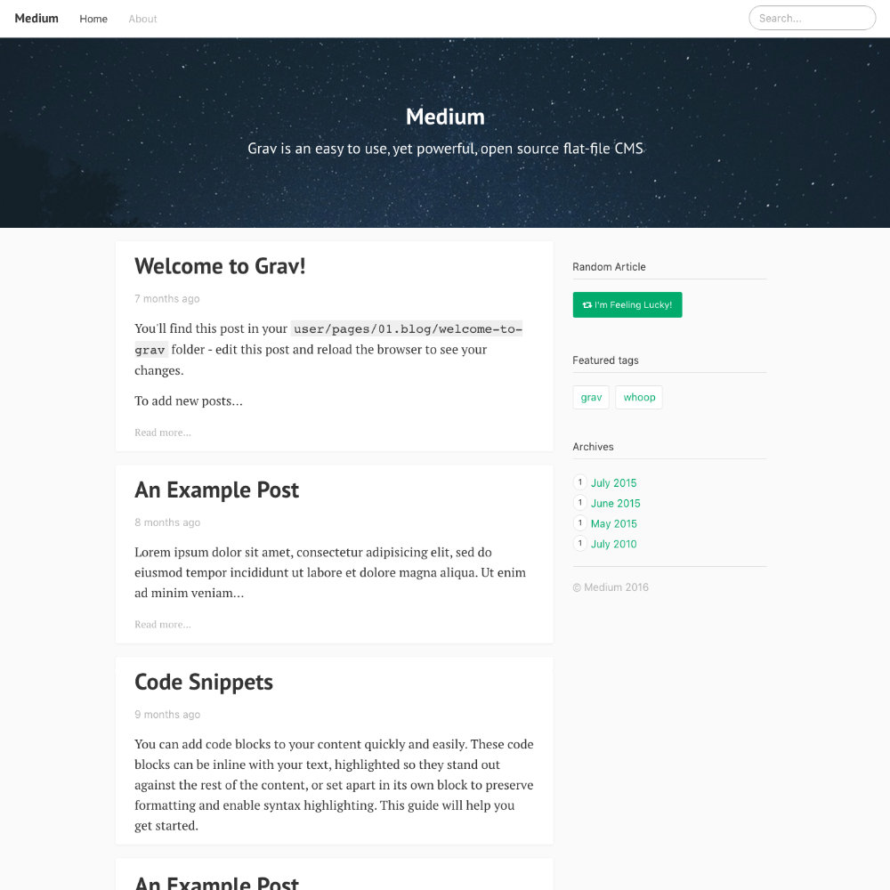

# Medium



Medium is a lightweight blogging theme based on the Medium's design language.

## Features

* Lightweight and minimal for optimal performance
* Infinite loading of blog posts utilizing the [pagination plugin](https://github.com/getgrav/grav-plugin-pagination).
* Multi-Language Compatible!
* Included languages:
    * English
    * Spanish
    * Czech
    * German
    * Italian
    * Finnish
    * French
    * Dutch
    * Polish
    * Portuguese
    * Romanian
    * Russian
* Super clean and modern design
* Twitter and Facebook integration
* Support for Disqus comments
* Google Analytics built-in


# Installation

Installing the Medium theme can be done in one of two ways. Our GPM (Grav Package Manager) installation method enables you to quickly and easily install the theme with a simple terminal command, while the manual method enables you to do so via a zip file.

The theme by itself is useful, but you may have an easier time getting up and running by installing a skeleton. The Medium theme is used in the [Multi-Language Skeleton](https://github.com/getgrav/grav-skeleton-multilanguage-site), which is a **read-to-run** site including: sample content, configuration, theme, and plugins.

## GPM Installation

The simplest way to install this theme is via the [Grav Package Manager (GPM)](http://learn.getgrav.org/advanced/grav-gpm) through your system's Terminal (also called the command line).  From the root of your Grav install type:

    bin/gpm install cacti

This will install the Medium theme into your `/user/themes` directory within Grav. Its files can be found under `/your/site/grav/user/themes/cacti`.

## GPM Update

The simplest way to update this theme is via the [Grav Package Manager (GPM)](http://learn.getgrav.org/advanced/grav-gpm). You can do this with this by navigating to the root directory of your Grav install using your system's Terminal (also called command line) and typing the following:

    bin/gpm update cacti

This command will check your Grav install to see if your Medium theme is due for an update. If a newer release is found, you will be asked whether or not you wish to update. To continue, type `y` and hit enter. The theme will automatically update and clear Grav's cache.

# Setup

If you want to set Medium as the default theme, you can do so by following these steps:

* Navigate to `/your/site/grav/user/config`.
* Open the **system.yaml** file.
* Change the `theme:` setting to `theme: cacti`.
* Save your changes.
* Clear the Grav cache. The simplest way to do this is by going to the root Grav directory in Terminal and typing `bin/grav clear-cache`.

# Configuration

The Medium theme has a few simple options that help you configure the theme (`cacti.yaml`):

```
enabled: true
default_lang: en
author: Wilberforce Humphries
title_header: false
home_profile: true
infinite_scroll: true
analytics: UA-YOURCODE
social:
    twitter: @getgrav
```

In order to configure Medium, you should copy the theme's `cacti.yaml` file into a file of your own: `user/config/themes/cacti.yaml` and make your modifications there.


Once this is done, you should be able to see the new theme on the frontend. Keep in mind any customizations made to the previous theme will not be reflected as all of the theme and templating information is now being pulled from the **cacti** folder.
