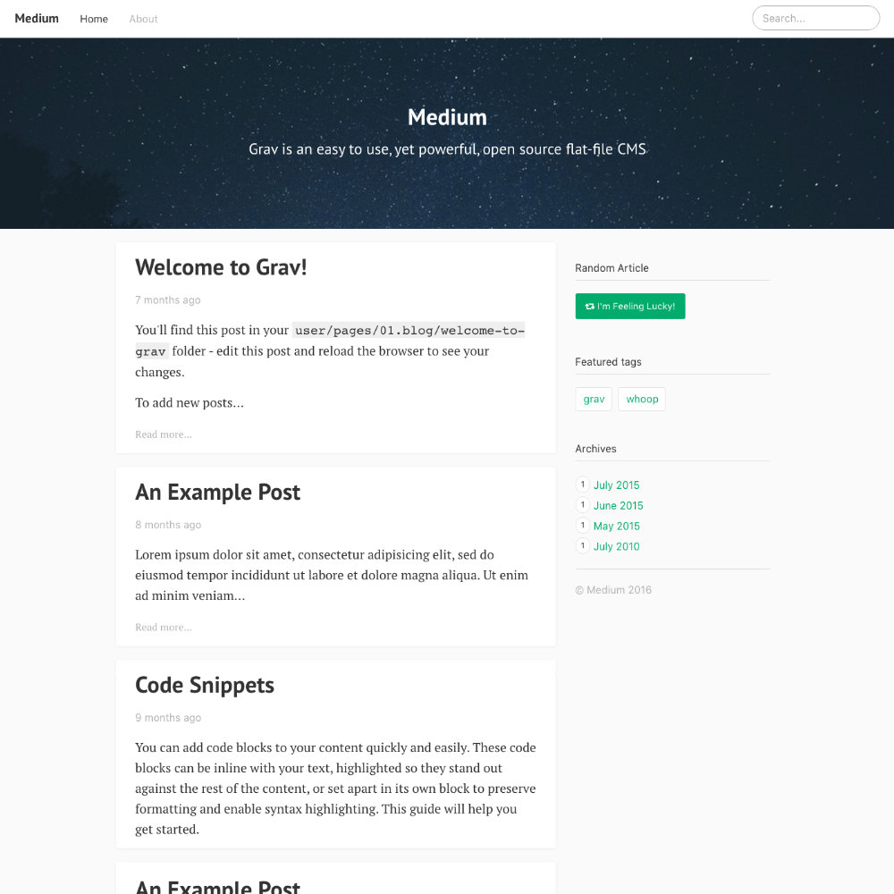

<div align="center">

# Medium

**A blogging theme for Grav CMS that borrows Medium's typography, built on Foundation 6**

Install it, copy the demo pages, and you have a blog with tags, archives, and search.



</div>

## Install

```bash
bin/gpm install medium
```

Run that from the root of your Grav install. The theme lands in `user/themes/medium`. To install it by hand instead, clone this repository into that folder.

## Quickstart

Seed the pages, then switch the theme over:

```bash
cp -R user/themes/medium/_demo/pages/* user/pages/
bin/grav clear-cache
```

Set `theme: medium` in `user/config/system.yaml`. The demo pages give you a home page, a blog listing with four posts, and an about page.

## Configuration

Copy `user/themes/medium/medium.yaml` to `user/config/themes/medium.yaml` and edit it there, or use the Themes screen in the Grav admin.

| Option | Default | What it does |
|--------|---------|--------------|
| `default_lang` | `en` | Fallback for the `<html lang>` attribute when no Grav language is active. |
| `analytics` | | Google Analytics property ID for the analytics partial. |
| `social.twitter` | `@getgrav` | Handle behind the avatar, the author name, and the Follow button. |
| `home_profile` | | Puts the author profile block above the blog listing instead of the page header. |

## Supported plugins

Each one is optional, and the templates check whether it is enabled before rendering anything.

- **[Pagination](https://github.com/getgrav/grav-plugin-pagination):** the Load More link at the foot of the blog listing.
- **[Archives](https://github.com/getgrav/grav-plugin-archives):** the month list in the sidebar.
- **[Taxonomy List](https://github.com/getgrav/grav-plugin-taxonomylist):** the featured tags in the sidebar.
- **[Random](https://github.com/getgrav/grav-plugin-random):** the I'm Feeling Lucky button in the sidebar.
- **[SimpleSearch](https://github.com/getgrav/grav-plugin-simplesearch):** the search box in the top bar and the results page.
- **[Feed](https://github.com/getgrav/grav-plugin-feed):** the Subscribe link in the top bar.
- **[LangSwitcher](https://github.com/getgrav/grav-plugin-langswitcher):** the language switcher in the top bar.

## Notes

- Comments come from Disqus, switched on per page with `disqus: true` in the page header. The shortname in `templates/partials/disqus.html.twig` is hardcoded and has to be changed to your own.
- The analytics partial ships Google's retired `analytics.js` snippet, so a `UA-` property collects nothing. Leave `analytics` unset and add your own tag instead.
- The blog listing always loads the next page in place with jScroll, so Pagination has to be enabled for it to have anything to load. The `infinite_scroll` option in the config is not read by any template.
- Foundation 6 and jQuery ship in the committed `bower_components` folder, with Font Awesome 4.7 and Google Fonts loaded from CDNs. Nothing has to be built to use the theme.
- Last released in December 2023, and looked after only as far as keeping it rendering.

## License

MIT

---

Crafted by [](https://blode.co) [Matthew Blode](https://blode.co)
